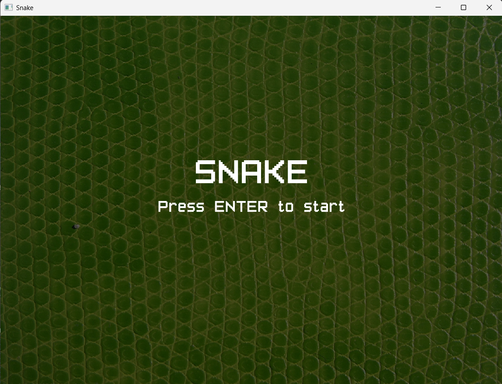
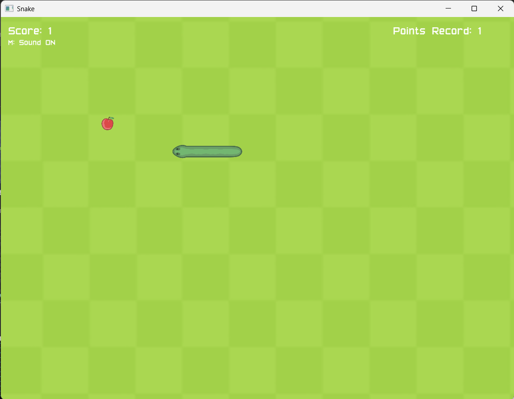
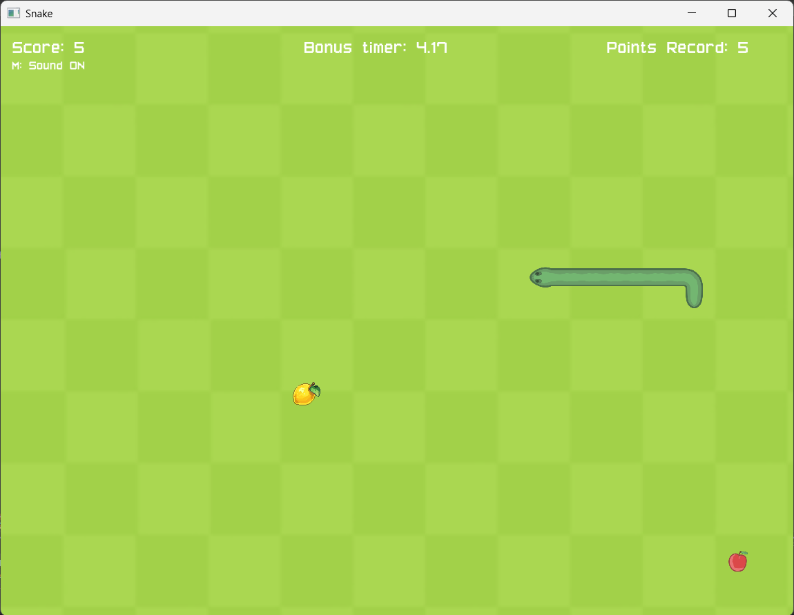
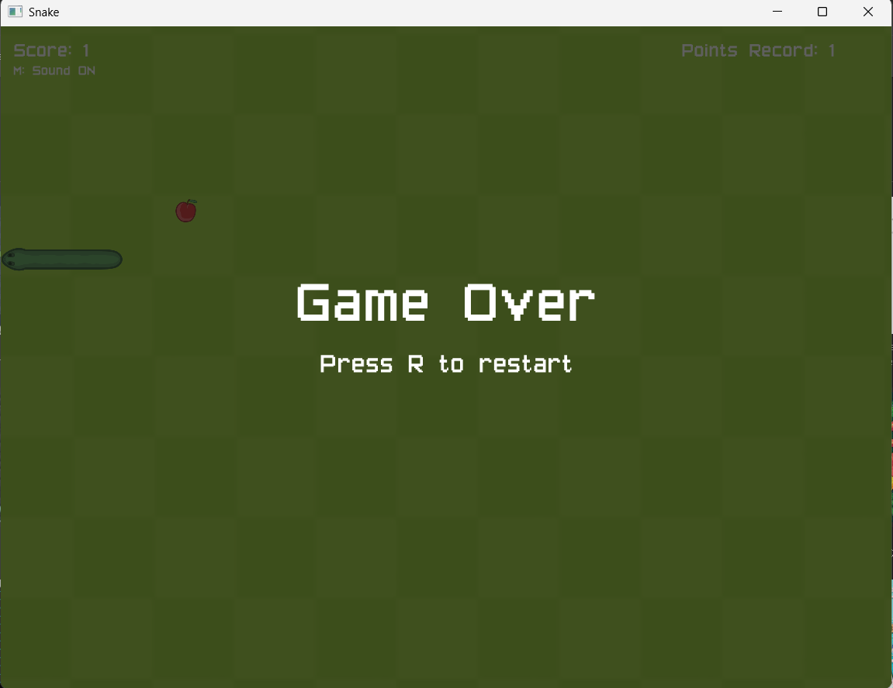
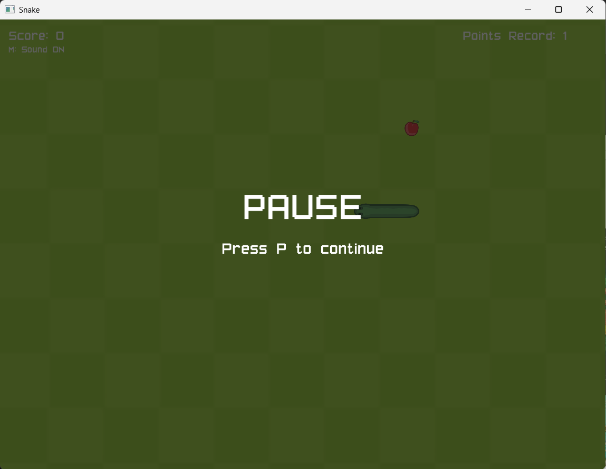

2D Snake game written in C++ using SFML.

## Features
- Main menu
- Pause system
- Sound effects
- Background music
- Score system
- Record points
- Sprite-based snake

## Controls
- Enter — start game
- P — pause / resume
- R — restart after game over
- Esc — back to menu
- M — mute / unmute music

## Technologies
- C++
- SFML
- Visual Studio

## How to Run
Download the Releases file or Open the project in Visual Studio, build it, and run the game.

## Screenshots

### Menu

### Gameplay

### Bonus

### Game Over

### Pause

